# Workflows

```mermaid
flowchart LR
    pullrequest(["🔀 pull_request"])
    schedule(["⏰ schedule"])
    workflowdispatch(["👤 workflow_dispatch"])
    createprforhttp4kupgradeyml["Create PR for http4k upgrade"]
    handleprforhttp4kupgradeyml["Handle PR for http4k upgrade"]
    updatedependenciesyml["Update Dependencies"]
    repositorydispatchgithubrepository(["🔔 repository_dispatch<br/>→ this repo"])
    pullrequest -->|"(labeled)"|handleprforhttp4kupgradeyml
    schedule -->|"0 08 * * 1"|updatedependenciesyml
    workflowdispatch --> updatedependenciesyml
    repositorydispatchgithubrepository -->|"http4k-release"|createprforhttp4kupgradeyml
```

## Workflows

- [Create PR for http4k upgrade](./create_pr_for_http4k_upgrade/)
- [Handle PR for http4k upgrade](./handle_pr_for_http4k_upgrade/)
- [Update Dependencies](./update-dependencies/)