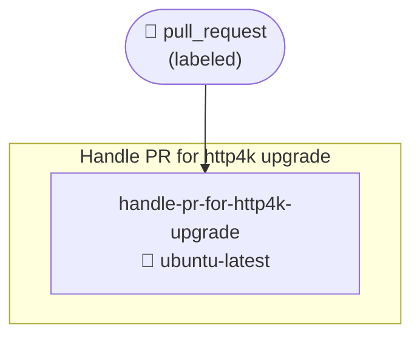
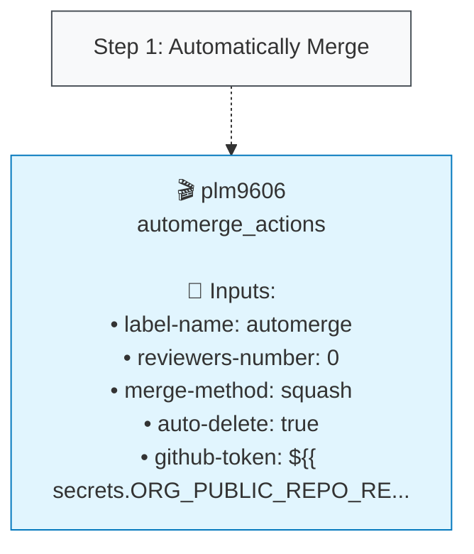

# Handle PR for http4k upgrade (handle_pr_for_http4k_upgrade.yml)

## Job: handle-pr-for-http4k-upgrade

| Job | OS | Dependencies | Config |
|-----|----|--------------|---------| 
| `handle-pr-for-http4k-upgrade` | 🐧 ubuntu-latest | - | - |

### Steps

**Step Types Legend:**
- 🔘 **Step Nodes** (Gray): Workflow step execution
- 🔵 **Action Blocks** (Blue): External GitHub Actions
- 🔷 **Action Blocks** (Light Blue): Local repository actions
- 🟣 **Script Nodes** (Purple): Run commands/scripts
- **Solid arrows** (→): Step execution flow
- **Dotted arrows** (-.->): Action usage with inputs